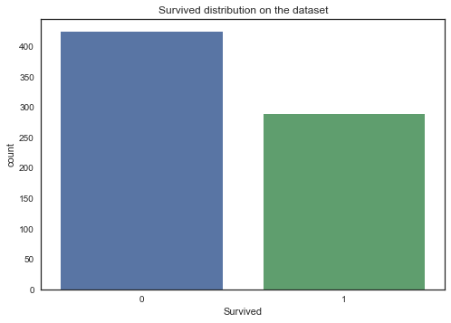
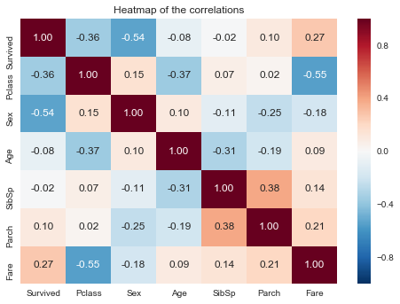
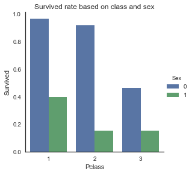
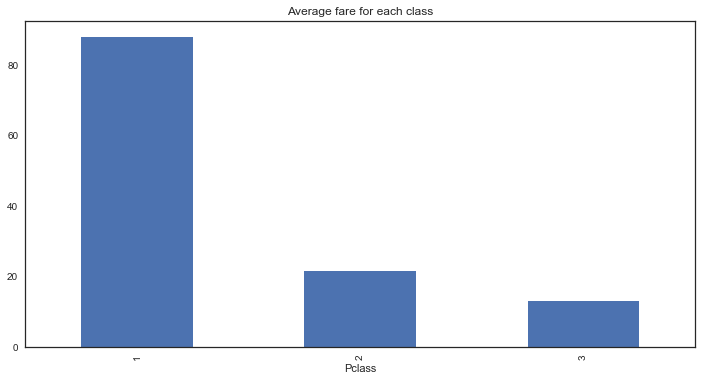
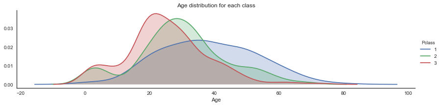
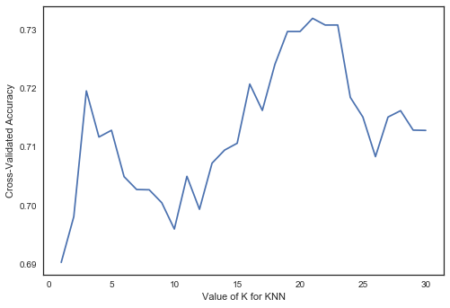
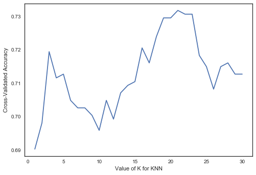

   # **TITANIC : MACHINE LEARNING FROM DISASTER**


*Hello and welcome to my notebook on the Titanic challenge from Kaggle ! This is a personal project and part of my training so it might not be perfect and could be improved. I tried to make it as comprehensible as possible and tutorial like so a non-technical person could understand it.*

## THE CHALLENGE 

Kaggle is a website that provides data sets to use for people who want to practice their data science skills. It also proposes challenges with a ranking and sometimes prices. This one is the Titanic challenge : Kaggle gives us a data set filled with people who were on the Titanic and their different caracteristics and if they survived or not. The goal is to predict the survival of a new person given his caracteristics and to have the best accuracy.

In this notebook we will : 
- Perform a quick exploratory data analysis on the data set in order to understand our parameters and how they relate to each other.
- Clean, reshape and create new features that we are going to feed to our models.
- Chose a predictive model, find the best parameters and evaluate it

I hope you will enjoy reading it as much as I did making it ! 

## EXPLORATORY DATA ANALYSIS (EDA)


### **1) Import Data**

Getting the data in the first place is a big challenge for data scientists. Luckily, Kaggle gives us a nice data set to use for the competition so we are just going to import the CSV file using pandas.

From Kaggle we get 2 data sets : "train" and "test". The test set is there only to validate our predictive model at the end of the study but we are going to import it at the same time so it's done.


```python
import pandas as pd 
import numpy as np

train = pd.read_csv("C:\\Users\\Brian\\Documents\\cours\\train.csv")
test = pd.read_csv("C:\\Users\\Brian\\Documents\\cours\\test.csv")

```

Usually the first thing we want to do is have a quick glance at our data. For this we have the attribute pd.shape and 2 basic methods : pd.head() and pd.describe()


```python
train.shape 
```


    (891, 12)


```python
train.head() # return 5 first rows
```


<div>
<style>
    .dataframe thead tr:only-child th {
        text-align: right;
    }

    .dataframe thead th {
        text-align: left;
    }

    .dataframe tbody tr th {
        vertical-align: top;
    }
</style>
<table border="1" class="dataframe">
  <thead>
    <tr style="text-align: right;">
      <th></th>
      <th>PassengerId</th>
      <th>Survived</th>
      <th>Pclass</th>
      <th>Name</th>
      <th>Sex</th>
      <th>Age</th>
      <th>SibSp</th>
      <th>Parch</th>
      <th>Ticket</th>
      <th>Fare</th>
      <th>Cabin</th>
      <th>Embarked</th>
    </tr>
  </thead>
  <tbody>
    <tr>
      <th>0</th>
      <td>1</td>
      <td>0</td>
      <td>3</td>
      <td>Braund, Mr. Owen Harris</td>
      <td>male</td>
      <td>22.0</td>
      <td>1</td>
      <td>0</td>
      <td>A/5 21171</td>
      <td>7.2500</td>
      <td>NaN</td>
      <td>S</td>
    </tr>
    <tr>
      <th>1</th>
      <td>2</td>
      <td>1</td>
      <td>1</td>
      <td>Cumings, Mrs. John Bradley (Florence Briggs Th...</td>
      <td>female</td>
      <td>38.0</td>
      <td>1</td>
      <td>0</td>
      <td>PC 17599</td>
      <td>71.2833</td>
      <td>C85</td>
      <td>C</td>
    </tr>
    <tr>
      <th>2</th>
      <td>3</td>
      <td>1</td>
      <td>3</td>
      <td>Heikkinen, Miss. Laina</td>
      <td>female</td>
      <td>26.0</td>
      <td>0</td>
      <td>0</td>
      <td>STON/O2. 3101282</td>
      <td>7.9250</td>
      <td>NaN</td>
      <td>S</td>
    </tr>
    <tr>
      <th>3</th>
      <td>4</td>
      <td>1</td>
      <td>1</td>
      <td>Futrelle, Mrs. Jacques Heath (Lily May Peel)</td>
      <td>female</td>
      <td>35.0</td>
      <td>1</td>
      <td>0</td>
      <td>113803</td>
      <td>53.1000</td>
      <td>C123</td>
      <td>S</td>
    </tr>
    <tr>
      <th>4</th>
      <td>5</td>
      <td>0</td>
      <td>3</td>
      <td>Allen, Mr. William Henry</td>
      <td>male</td>
      <td>35.0</td>
      <td>0</td>
      <td>0</td>
      <td>373450</td>
      <td>8.0500</td>
      <td>NaN</td>
      <td>S</td>
    </tr>
  </tbody>
</table>
</div>


```python
train.describe(include = 'all') ## pro tip : add "include = "all"" to show the non numerical columns
```


<div>
<style>
    .dataframe thead tr:only-child th {
        text-align: right;
    }

    .dataframe thead th {
        text-align: left;
    }

    .dataframe tbody tr th {
        vertical-align: top;
    }
</style>
<table border="1" class="dataframe">
  <thead>
    <tr style="text-align: right;">
      <th></th>
      <th>PassengerId</th>
      <th>Survived</th>
      <th>Pclass</th>
      <th>Name</th>
      <th>Sex</th>
      <th>Age</th>
      <th>SibSp</th>
      <th>Parch</th>
      <th>Ticket</th>
      <th>Fare</th>
      <th>Cabin</th>
      <th>Embarked</th>
    </tr>
  </thead>
  <tbody>
    <tr>
      <th>count</th>
      <td>891.000000</td>
      <td>891.000000</td>
      <td>891.000000</td>
      <td>891</td>
      <td>891</td>
      <td>714.000000</td>
      <td>891.000000</td>
      <td>891.000000</td>
      <td>891</td>
      <td>891.000000</td>
      <td>204</td>
      <td>889</td>
    </tr>
    <tr>
      <th>unique</th>
      <td>NaN</td>
      <td>NaN</td>
      <td>NaN</td>
      <td>891</td>
      <td>2</td>
      <td>NaN</td>
      <td>NaN</td>
      <td>NaN</td>
      <td>681</td>
      <td>NaN</td>
      <td>147</td>
      <td>3</td>
    </tr>
    <tr>
      <th>top</th>
      <td>NaN</td>
      <td>NaN</td>
      <td>NaN</td>
      <td>Carter, Miss. Lucile Polk</td>
      <td>male</td>
      <td>NaN</td>
      <td>NaN</td>
      <td>NaN</td>
      <td>1601</td>
      <td>NaN</td>
      <td>C23 C25 C27</td>
      <td>S</td>
    </tr>
    <tr>
      <th>freq</th>
      <td>NaN</td>
      <td>NaN</td>
      <td>NaN</td>
      <td>1</td>
      <td>577</td>
      <td>NaN</td>
      <td>NaN</td>
      <td>NaN</td>
      <td>7</td>
      <td>NaN</td>
      <td>4</td>
      <td>644</td>
    </tr>
    <tr>
      <th>mean</th>
      <td>446.000000</td>
      <td>0.383838</td>
      <td>2.308642</td>
      <td>NaN</td>
      <td>NaN</td>
      <td>29.699118</td>
      <td>0.523008</td>
      <td>0.381594</td>
      <td>NaN</td>
      <td>32.204208</td>
      <td>NaN</td>
      <td>NaN</td>
    </tr>
    <tr>
      <th>std</th>
      <td>257.353842</td>
      <td>0.486592</td>
      <td>0.836071</td>
      <td>NaN</td>
      <td>NaN</td>
      <td>14.526497</td>
      <td>1.102743</td>
      <td>0.806057</td>
      <td>NaN</td>
      <td>49.693429</td>
      <td>NaN</td>
      <td>NaN</td>
    </tr>
    <tr>
      <th>min</th>
      <td>1.000000</td>
      <td>0.000000</td>
      <td>1.000000</td>
      <td>NaN</td>
      <td>NaN</td>
      <td>0.420000</td>
      <td>0.000000</td>
      <td>0.000000</td>
      <td>NaN</td>
      <td>0.000000</td>
      <td>NaN</td>
      <td>NaN</td>
    </tr>
    <tr>
      <th>25%</th>
      <td>223.500000</td>
      <td>0.000000</td>
      <td>2.000000</td>
      <td>NaN</td>
      <td>NaN</td>
      <td>20.125000</td>
      <td>0.000000</td>
      <td>0.000000</td>
      <td>NaN</td>
      <td>7.910400</td>
      <td>NaN</td>
      <td>NaN</td>
    </tr>
    <tr>
      <th>50%</th>
      <td>446.000000</td>
      <td>0.000000</td>
      <td>3.000000</td>
      <td>NaN</td>
      <td>NaN</td>
      <td>28.000000</td>
      <td>0.000000</td>
      <td>0.000000</td>
      <td>NaN</td>
      <td>14.454200</td>
      <td>NaN</td>
      <td>NaN</td>
    </tr>
    <tr>
      <th>75%</th>
      <td>668.500000</td>
      <td>1.000000</td>
      <td>3.000000</td>
      <td>NaN</td>
      <td>NaN</td>
      <td>38.000000</td>
      <td>1.000000</td>
      <td>0.000000</td>
      <td>NaN</td>
      <td>31.000000</td>
      <td>NaN</td>
      <td>NaN</td>
    </tr>
    <tr>
      <th>max</th>
      <td>891.000000</td>
      <td>1.000000</td>
      <td>3.000000</td>
      <td>NaN</td>
      <td>NaN</td>
      <td>80.000000</td>
      <td>8.000000</td>
      <td>6.000000</td>
      <td>NaN</td>
      <td>512.329200</td>
      <td>NaN</td>
      <td>NaN</td>
    </tr>
  </tbody>
</table>
</div>


Alright our data set has 891 rows and 12 columns (=caracteristic, =parameter) :

* PassengerId
* Survived 
* Pclass: the passenger class. It has three possible values: 1,2,3
* The Name
* The Sex
* The Age
* SibSp: number of siblings and spouses traveling with the passenger
* Parch: number of parents and children traveling with the passenger
* The ticket number
* The ticket Fare
* The cabin number
* The embarkation. It has three possible values S,C,Q

We can see that we have only 204 out of 891 values for Cabin, that's not enough to take into consideration so we are going to drop this feature. Also, we can see from train.head() that the ticket number and PassengerId features seem useless so we're going to delete them aswell. 

We also have missing values for Age. In this quick EDA we're just going to drop the rows with a NaN value using pd.dropna().


```python
train = train.drop(['Ticket','Cabin','PassengerId'], axis=1)
train = train.dropna() #drop rows with a NaN value
train['Sex'] = train['Sex'].map({'male':1,'female':0}) 
train.head()
```


<div>
<style>
    .dataframe thead tr:only-child th {
        text-align: right;
    }

    .dataframe thead th {
        text-align: left;
    }

    .dataframe tbody tr th {
        vertical-align: top;
    }
</style>
<table border="1" class="dataframe">
  <thead>
    <tr style="text-align: right;">
      <th></th>
      <th>Survived</th>
      <th>Pclass</th>
      <th>Name</th>
      <th>Sex</th>
      <th>Age</th>
      <th>SibSp</th>
      <th>Parch</th>
      <th>Fare</th>
      <th>Embarked</th>
    </tr>
  </thead>
  <tbody>
    <tr>
      <th>0</th>
      <td>0</td>
      <td>3</td>
      <td>Braund, Mr. Owen Harris</td>
      <td>1</td>
      <td>22.0</td>
      <td>1</td>
      <td>0</td>
      <td>7.2500</td>
      <td>S</td>
    </tr>
    <tr>
      <th>1</th>
      <td>1</td>
      <td>1</td>
      <td>Cumings, Mrs. John Bradley (Florence Briggs Th...</td>
      <td>0</td>
      <td>38.0</td>
      <td>1</td>
      <td>0</td>
      <td>71.2833</td>
      <td>C</td>
    </tr>
    <tr>
      <th>2</th>
      <td>1</td>
      <td>3</td>
      <td>Heikkinen, Miss. Laina</td>
      <td>0</td>
      <td>26.0</td>
      <td>0</td>
      <td>0</td>
      <td>7.9250</td>
      <td>S</td>
    </tr>
    <tr>
      <th>3</th>
      <td>1</td>
      <td>1</td>
      <td>Futrelle, Mrs. Jacques Heath (Lily May Peel)</td>
      <td>0</td>
      <td>35.0</td>
      <td>1</td>
      <td>0</td>
      <td>53.1000</td>
      <td>S</td>
    </tr>
    <tr>
      <th>4</th>
      <td>0</td>
      <td>3</td>
      <td>Allen, Mr. William Henry</td>
      <td>1</td>
      <td>35.0</td>
      <td>0</td>
      <td>0</td>
      <td>8.0500</td>
      <td>S</td>
    </tr>
  </tbody>
</table>
</div>


### **2) Data visualization**

Now we're going to have a look at our data using graphs using  **matplotlib** and **seaborn** :
Let's start with our Survived feature distribution : 


```python
%matplotlib inline
import matplotlib.pyplot as plt
import seaborn as sns
sns.set_style('white')
```

Let's start with our Survived feature distribution : 


```python
g = sns.countplot("Survived", data = train)
plt.title("Survived distribution on the dataset")
sns.plt.show()
```





We can already see that in our dataset more people died than survived on the Titanic. 

Next we are going to create a **correlation heatmap**. Correlation is a statistical technique that is used to measure and describe the strength and direction of the relationship between two variables. 


```python
g = sns.heatmap(train.corr(), annot=True, fmt=".2f")
plt.title("Heatmap of the correlations")
sns.plt.show()
```





Here we can see positive correlations between :
* ** Survived and Fare **: People who paid more for their ticket tend to have a higher Survived rate.
* **Parch and Sibsp** : Sibsp is the number of siblings +spouses and Parch is the number of parents and children so it makes sense that the 2 are correlated.
* **Parch and Fare** : People who have a big family pay more for their ticket, because usually if you can afford to travel with a big family you can afford an expensive ticket.

And negative correlations between :
* **Survived and Sex** : Men have a Survived rate way lower than women, thus "Women and child first!"
* **Survived and Pclass** : Our classes go from 1 to 3 with 3 being the cheapest and 1 the most expensive. Here a negative correlation means that people who are in the third class tend to have a lower Survived rate. 
* **Pclass and Fare** : The class is determined by the price of the ticket.
* **Pclass and Age** : The older people tend to be in the most expensive classes.


Let's have a more precize look of these features to confirm our insuptions : 


```python
g = sns.factorplot("Pclass","Survived", hue="Sex", kind = "bar", data=train, ci = None)
plt.title("Survived rate based on class and sex")
sns.plt.show()
```





```python
train.groupby('Pclass').mean()['Fare'].plot(kind='bar',figsize=(12,6))
plt.title("Average fare for each class")
sns.plt.show()
```





```python
fig = sns.FacetGrid(train,hue='Pclass',aspect=4)
fig.map(sns.kdeplot,'Age',shade=True)
plt.title("Age distribution for each class")
fig.add_legend()
sns.plt.show()
```





Alright, we took a glance at the data and spotted some interesting correlations. However, we couldn't manage to analyze more complicated features like the names because these required further processing. This is why in the next part we'll focus on the ways to transform these features to fit our machine learning algorithms.


## **FEATURE ENGINEERING**

**Feature engineering** is the process of reshaping, transforming or creating new features based on the previous ones. We're going to do it on both data sets, so to save time we'll combine the train and test set together :


```python
train = pd.read_csv("C:\\Users\\Brian\\Documents\\cours\\train.csv")
test = pd.read_csv("C:\\Users\\Brian\\Documents\\cours\\test.csv")

data = train.append(test)
data.shape
```


    (1309, 12)


```python
data.describe(include = "all")
```


<div>
<style>
    .dataframe thead tr:only-child th {
        text-align: right;
    }

    .dataframe thead th {
        text-align: left;
    }

    .dataframe tbody tr th {
        vertical-align: top;
    }
</style>
<table border="1" class="dataframe">
  <thead>
    <tr style="text-align: right;">
      <th></th>
      <th>Age</th>
      <th>Cabin</th>
      <th>Embarked</th>
      <th>Fare</th>
      <th>Name</th>
      <th>Parch</th>
      <th>PassengerId</th>
      <th>Pclass</th>
      <th>Sex</th>
      <th>SibSp</th>
      <th>Survived</th>
      <th>Ticket</th>
    </tr>
  </thead>
  <tbody>
    <tr>
      <th>count</th>
      <td>1046.000000</td>
      <td>295</td>
      <td>1307</td>
      <td>1308.000000</td>
      <td>1309</td>
      <td>1309.000000</td>
      <td>1309.000000</td>
      <td>1309.000000</td>
      <td>1309</td>
      <td>1309.000000</td>
      <td>891.000000</td>
      <td>1309</td>
    </tr>
    <tr>
      <th>unique</th>
      <td>NaN</td>
      <td>186</td>
      <td>3</td>
      <td>NaN</td>
      <td>1307</td>
      <td>NaN</td>
      <td>NaN</td>
      <td>NaN</td>
      <td>2</td>
      <td>NaN</td>
      <td>NaN</td>
      <td>929</td>
    </tr>
    <tr>
      <th>top</th>
      <td>NaN</td>
      <td>C23 C25 C27</td>
      <td>S</td>
      <td>NaN</td>
      <td>Kelly, Mr. James</td>
      <td>NaN</td>
      <td>NaN</td>
      <td>NaN</td>
      <td>male</td>
      <td>NaN</td>
      <td>NaN</td>
      <td>CA. 2343</td>
    </tr>
    <tr>
      <th>freq</th>
      <td>NaN</td>
      <td>6</td>
      <td>914</td>
      <td>NaN</td>
      <td>2</td>
      <td>NaN</td>
      <td>NaN</td>
      <td>NaN</td>
      <td>843</td>
      <td>NaN</td>
      <td>NaN</td>
      <td>11</td>
    </tr>
    <tr>
      <th>mean</th>
      <td>29.881138</td>
      <td>NaN</td>
      <td>NaN</td>
      <td>33.295479</td>
      <td>NaN</td>
      <td>0.385027</td>
      <td>655.000000</td>
      <td>2.294882</td>
      <td>NaN</td>
      <td>0.498854</td>
      <td>0.383838</td>
      <td>NaN</td>
    </tr>
    <tr>
      <th>std</th>
      <td>14.413493</td>
      <td>NaN</td>
      <td>NaN</td>
      <td>51.758668</td>
      <td>NaN</td>
      <td>0.865560</td>
      <td>378.020061</td>
      <td>0.837836</td>
      <td>NaN</td>
      <td>1.041658</td>
      <td>0.486592</td>
      <td>NaN</td>
    </tr>
    <tr>
      <th>min</th>
      <td>0.170000</td>
      <td>NaN</td>
      <td>NaN</td>
      <td>0.000000</td>
      <td>NaN</td>
      <td>0.000000</td>
      <td>1.000000</td>
      <td>1.000000</td>
      <td>NaN</td>
      <td>0.000000</td>
      <td>0.000000</td>
      <td>NaN</td>
    </tr>
    <tr>
      <th>25%</th>
      <td>21.000000</td>
      <td>NaN</td>
      <td>NaN</td>
      <td>7.895800</td>
      <td>NaN</td>
      <td>0.000000</td>
      <td>328.000000</td>
      <td>2.000000</td>
      <td>NaN</td>
      <td>0.000000</td>
      <td>0.000000</td>
      <td>NaN</td>
    </tr>
    <tr>
      <th>50%</th>
      <td>28.000000</td>
      <td>NaN</td>
      <td>NaN</td>
      <td>14.454200</td>
      <td>NaN</td>
      <td>0.000000</td>
      <td>655.000000</td>
      <td>3.000000</td>
      <td>NaN</td>
      <td>0.000000</td>
      <td>0.000000</td>
      <td>NaN</td>
    </tr>
    <tr>
      <th>75%</th>
      <td>39.000000</td>
      <td>NaN</td>
      <td>NaN</td>
      <td>31.275000</td>
      <td>NaN</td>
      <td>0.000000</td>
      <td>982.000000</td>
      <td>3.000000</td>
      <td>NaN</td>
      <td>1.000000</td>
      <td>1.000000</td>
      <td>NaN</td>
    </tr>
    <tr>
      <th>max</th>
      <td>80.000000</td>
      <td>NaN</td>
      <td>NaN</td>
      <td>512.329200</td>
      <td>NaN</td>
      <td>9.000000</td>
      <td>1309.000000</td>
      <td>3.000000</td>
      <td>NaN</td>
      <td>8.000000</td>
      <td>1.000000</td>
      <td>NaN</td>
    </tr>
  </tbody>
</table>
</div>


```python
data.info()
```

    <class 'pandas.core.frame.DataFrame'>
    Int64Index: 1309 entries, 0 to 417
    Data columns (total 12 columns):
    Age            1046 non-null float64
    Cabin          295 non-null object
    Embarked       1307 non-null object
    Fare           1308 non-null float64
    Name           1309 non-null object
    Parch          1309 non-null int64
    PassengerId    1309 non-null int64
    Pclass         1309 non-null int64
    Sex            1309 non-null object
    SibSp          1309 non-null int64
    Survived       891 non-null float64
    Ticket         1309 non-null object
    dtypes: float64(3), int64(4), object(5)
    memory usage: 132.9+ KB
    

For the same reason as mentionned at the begining, we're going to drop our useless / unusable features. We are also going to **drop the Survived feature** which is our **target** (= the feature we will try to predict with out model).  


```python
data = data.drop(['Survived','Ticket','Cabin','PassengerId'], axis=1)
```

### **Processing Name** :
if we look closely at the Name feature, we can see that each name has title in it : for example "Braund, Mr. Owen Harris" has the title "Mr". We can group these title into categories  and create a new feature. 

So first, we're breaking each name using the first "," and the "." and extract the title. There's a lot of them so we then proceed to group them into 5 categories :
* Officer
* Royalty
* Mrs
* Miss
* Master


```python
def get_title(name):
    if '.' in name:
        return name.split(',')[1].split('.')[0].strip() #parse the name and return the title
    else:
        return 'Unknown'
    
Title_Map = {
                        "Capt":       "Officer",
                        "Col":        "Officer",
                        "Major":      "Officer",   #map of the titles
                        "Jonkheer":   "Royalty",
                        "Don":        "Royalty",
                        "Sir" :       "Royalty",
                        "Dr":         "Officer",
                        "Rev":        "Officer",
                        "the Countess":"Royalty",
                        "Dona":       "Royalty",
                        "Mme":        "Mrs",
                        "Mlle":       "Miss",
                        "Ms":         "Mrs",
                        "Mr" :        "Mr",
                        "Mrs" :       "Mrs",
                        "Miss" :      "Miss",
                        "Master" :    "Master",
                        "Lady" :      "Royalty"

                        }
    
data["Title"] = data["Name"].apply(get_title).map(Title_Map) #create new column Title from the name
```

We now have a **Title** for each of our passenger. 


### **Processing Age :** 
We're missing a lot of value for our Age feature and we can't just drop these rows because it would hurt our model accuracy to much. We could just use the mean or the median of all the ages but we can do better here.
We can group our passengers by sex, class and our newly created feature title and get the median age of each group, and then replace our missing values based on the other features for each passenger


```python
data["Age"] = data.groupby(['Sex','Pclass','Title'])['Age'].transform(lambda x: x.fillna(x.median()))
data.info()
```

    <class 'pandas.core.frame.DataFrame'>
    Int64Index: 1309 entries, 0 to 417
    Data columns (total 9 columns):
    Age         1309 non-null float64
    Embarked    1307 non-null object
    Fare        1308 non-null float64
    Name        1309 non-null object
    Parch       1309 non-null int64
    Pclass      1309 non-null int64
    Sex         1309 non-null object
    SibSp       1309 non-null int64
    Title       1309 non-null object
    dtypes: float64(2), int64(3), object(4)
    memory usage: 102.3+ KB
    


### **Processing Title :**

Models usually need  numerical variables, this is why when we have categorical parameters we need to transform them.
One way to do it is with dummy encoding. For example here we have one categorical feature "Title" with 5 categories as strings. The function pd.get_dummies will create a column for each category and fill it with 0 and 1, 1 meaning that the passenger is in this category.


```python
titles_dummies = pd.get_dummies(data['Title'],prefix='Title') #creating the new columns 
data = pd.concat([data,titles_dummies],axis=1) #adding them to the data frame

data.drop("Name", axis=1, inplace = True) #we don't need Name anymore so we drop it
data.head()
```


<div>
<style>
    .dataframe thead tr:only-child th {
        text-align: right;
    }

    .dataframe thead th {
        text-align: left;
    }

    .dataframe tbody tr th {
        vertical-align: top;
    }
</style>
<table border="1" class="dataframe">
  <thead>
    <tr style="text-align: right;">
      <th></th>
      <th>Age</th>
      <th>Embarked</th>
      <th>Fare</th>
      <th>Parch</th>
      <th>Pclass</th>
      <th>Sex</th>
      <th>SibSp</th>
      <th>Title</th>
      <th>Title_Master</th>
      <th>Title_Miss</th>
      <th>Title_Mr</th>
      <th>Title_Mrs</th>
      <th>Title_Officer</th>
      <th>Title_Royalty</th>
    </tr>
  </thead>
  <tbody>
    <tr>
      <th>0</th>
      <td>22.0</td>
      <td>S</td>
      <td>7.2500</td>
      <td>0</td>
      <td>3</td>
      <td>male</td>
      <td>1</td>
      <td>Mr</td>
      <td>0</td>
      <td>0</td>
      <td>1</td>
      <td>0</td>
      <td>0</td>
      <td>0</td>
    </tr>
    <tr>
      <th>1</th>
      <td>38.0</td>
      <td>C</td>
      <td>71.2833</td>
      <td>0</td>
      <td>1</td>
      <td>female</td>
      <td>1</td>
      <td>Mrs</td>
      <td>0</td>
      <td>0</td>
      <td>0</td>
      <td>1</td>
      <td>0</td>
      <td>0</td>
    </tr>
    <tr>
      <th>2</th>
      <td>26.0</td>
      <td>S</td>
      <td>7.9250</td>
      <td>0</td>
      <td>3</td>
      <td>female</td>
      <td>0</td>
      <td>Miss</td>
      <td>0</td>
      <td>1</td>
      <td>0</td>
      <td>0</td>
      <td>0</td>
      <td>0</td>
    </tr>
    <tr>
      <th>3</th>
      <td>35.0</td>
      <td>S</td>
      <td>53.1000</td>
      <td>0</td>
      <td>1</td>
      <td>female</td>
      <td>1</td>
      <td>Mrs</td>
      <td>0</td>
      <td>0</td>
      <td>0</td>
      <td>1</td>
      <td>0</td>
      <td>0</td>
    </tr>
    <tr>
      <th>4</th>
      <td>35.0</td>
      <td>S</td>
      <td>8.0500</td>
      <td>0</td>
      <td>3</td>
      <td>male</td>
      <td>0</td>
      <td>Mr</td>
      <td>0</td>
      <td>0</td>
      <td>1</td>
      <td>0</td>
      <td>0</td>
      <td>0</td>
    </tr>
  </tbody>
</table>
</div>


### **Processing Fare : **
We have a few missing values here to we're just going to fill them with the mean


```python
data.Fare.fillna(data.Fare.mean(), inplace=True)
```

### **Processing Embarked :**
We also have a few missing values so we're going to replace it with the most frequent one : S, and then get the dummy columns.


```python
data.Embarked.fillna('S', inplace=True)
Embarked_dummies = pd.get_dummies(data['Embarked'],prefix='Embarked')
data = pd.concat([data,Embarked_dummies],axis=1)
```

### **Processing Parch and Sibsp :**
We're going to use Parch and Sibsp  to create a new one called "Familysize" that will basicly be the addition of these 2 features plus the passenger.
Then we will break it into 3 categories : singleton (passenger alone), small family and large family.


```python
data['FamilySize'] = data['Parch'] + data['SibSp'] + 1

data['Singleton'] = data['FamilySize'].map(lambda s: 1 if s == 1 else 0)
data['SmallFamily'] = data['FamilySize'].map(lambda s: 1 if 2<=s<=4 else 0)
data['LargeFamily'] = data['FamilySize'].map(lambda s: 1 if 5<=s else 0)
```

### **Processing Sex :**
Here we're just going to transform our strings into a numerical variable.


```python
data['Sex'] = data['Sex'].map({'male':1,'female':0})
```

### Processing Pclass : 
Just dummy encoding our feature.


```python
pclass_dummies = pd.get_dummies(data['Pclass'], prefix="Pclass") 
data = pd.concat([data,pclass_dummies],axis=1)

```

Alright, we're almost there. Now we're going to **drop** the old features that are useless now


```python
data.drop(['Pclass','Embarked','Title'],axis=1,inplace=True)
data.shape
```


    (1309, 21)


## **MODELING**

This is the exciting part where we are going to **make predictions** using our data. The first thing we want to do is **splitting** back our data into a train set and a test set. It is a crucial part because we need a way to evaluate our modele at the end to get a score for Kaggle.


```python
train0 = pd.read_csv("C:\\Users\\Brian\\Documents\\cours\\train.csv")

targets = train0.Survived
train = data.head(891) #when we created our data set "data" we basicly put our test dataframe at 
                       #the end of the train one, so we can split it just by selecting the values before 891  
test = data.iloc[891:]

```

Alright so here we have a **classification** problem : we're trying to predict a **categorical response** "Suvived" which is translated into a 0 or a 1. There are many classification modeles we can use with the **Scikit-learn** package but first we need a way to **evaluate** our modele performance.

Since we can't test our modele on the same data it was trained, we have to split our train dataframe again. It might be confusing but to clarify : we first split train and set only for the Kaggle challenge score and then we do it to evaluate the modele for ourselves.

We're going to use **cross validation** from Sklearn : 


```python
from sklearn.model_selection import cross_val_score #import the function from sklearn
def compute_score(classifier, X, y, scoring='accuracy'):
    xval = cross_val_score(classifier, X, y, cv = 5, scoring=scoring)
    #cv stands for cross validation : the number of time we're going to split our data and test it.
    return np.mean(xval) #return the mean of the 5 scores
```

Now that we have our tool to evaluate our model, let's start with one of the simplest classification model : **KNN**. You can learn more about KNN here : http://scikit-learn.org/stable/modules/neighbors.html

First we import the model from Sklearn.neighbors, then make an instance of our estimator (=model). This is where we enter the **parameters** we want, here we're going to select K=1


```python
from sklearn.neighbors import KNeighborsClassifier
knn = KNeighborsClassifier(n_neighbors=1)
knn
```


    KNeighborsClassifier(algorithm='auto', leaf_size=30, metric='minkowski',
               metric_params=None, n_jobs=1, n_neighbors=1, p=2,
               weights='uniform')


Alright now we **fit** the model on our data and use our compute_score to get an accuracy score


```python
knn.fit(train,targets) #feeding the model with data
knn_score = compute_score(knn,train,targets) #evaluating the model with our function
knn_score
```


    0.69029802605657808


This is our result for K=1.
Now let's try for different values of K with a for loop.


```python
k_range = list(range(1, 31))
k_scores = []
for k in k_range:
    knn = KNeighborsClassifier(n_neighbors=k)
    scores = compute_score(knn, train,targets)
    k_scores.append(scores.mean())
print(k_scores)
```

    [0.69029802605657808, 0.69808794068488145, 0.71951849554594016, 0.71165974593116421, 0.71280837878889436, 0.70491182490024962, 0.70271477952058081, 0.70267055632216191, 0.70046109865745176, 0.69597955448407978, 0.70496204145915997, 0.69934399300372685, 0.70720930339773891, 0.70943766319938351, 0.71059906297887043, 0.72068631424997709, 0.71619179037281888, 0.72403812770255338, 0.72963748680308116, 0.72963741587573805, 0.73188453595963099, 0.73074203831707851, 0.73074831538694229, 0.7184139440319427, 0.7150619887246803, 0.70832027383628626, 0.71506191779733708, 0.7161477090290862, 0.71283348706834959, 0.71278940572461669]
    

We plot our results :


```python
plt.plot(k_range, k_scores)
plt.xlabel('Value of K for KNN')
plt.ylabel('Cross-Validated Accuracy')
```


    <matplotlib.text.Text at 0x1e3b1249f60>





We can see that the best accuracy with this model is with **K=21**.

There's a tool we can use to test every **combination** for each **parameters** and find the best one : **GridSearchCV**. We feed it with the map of parameters we want it to test and then fit our data.


```python
from sklearn.grid_search import GridSearchCV #import gridsearch
k_range = list(range(1, 31)) 
param_grid = dict(n_neighbors=k_range) #define the map(=parameters we want to try)
grid = GridSearchCV(knn, param_grid, cv=5, scoring='accuracy') 
grid.fit(train, targets)

grid_mean_scores = [result.mean_validation_score for result in grid.grid_scores_]
plt.plot(k_range, grid_mean_scores)
plt.xlabel('Value of K for KNN')
plt.ylabel('Cross-Validated Accuracy')
```

    C:\Users\Brian\Anaconda3\lib\site-packages\sklearn\cross_validation.py:44: DeprecationWarning: This module was deprecated in version 0.18 in favor of the model_selection module into which all the refactored classes and functions are moved. Also note that the interface of the new CV iterators are different from that of this module. This module will be removed in 0.20.
      "This module will be removed in 0.20.", DeprecationWarning)
    C:\Users\Brian\Anaconda3\lib\site-packages\sklearn\grid_search.py:43: DeprecationWarning: This module was deprecated in version 0.18 in favor of the model_selection module into which all the refactored classes and functions are moved. This module will be removed in 0.20.
      DeprecationWarning)
    


    <matplotlib.text.Text at 0x1e3b13544a8>





We notice that this plot is the same as the previous one.


Alright now let's try a more complex model : **Random forest classifier**. Random forest uses decision trees. You can learn more about it here : https://www.stat.berkeley.edu/~breiman/RandomForests/cc_home.htm

Let's try it with the basic parameters : 


```python
from sklearn.ensemble import RandomForestClassifier

rdc = RandomForestClassifier()
rdc.fit(train,targets)
rdc_score = compute_score(rdc,train,targets,scoring='accuracy')
rdc_score
```


    0.78789497220889371


Now we use **GridSearchCV** to find the best combination of parameters. It takes some time to run so I've put the code in an If statement, you don't have to run it, the result is below.


```python
run_grid = False
if run_grid :
    param_grid = {'max_depth' : [4, 6, 8],      # map of the parameters we want to try
                 'n_estimators': [50, 10],
                 'max_features': ['sqrt', 'auto', 'log2'],
                 'min_samples_split': [2, 3, 10],
                 'min_samples_leaf': [1, 3, 10],
                 'bootstrap': [True, False],}
    grid = GridSearchCV(rdc, param_grid, cv=10, scoring='accuracy')
    grid.fit(train, targets)
    grid_mean_scores = [result.mean_validation_score for result in grid.grid_scores_]
    model = grid
    parameters = grid.best_params_ 
    print(grid.best_score_)
    print(grid.best_params_)
else : 
    parameters = {'bootstrap': False, 'max_depth': 6, 'max_features': 'auto', 'min_samples_leaf': 3,
              'min_samples_split': 3, 'n_estimators': 10}
    model = RandomForestClassifier(**parameters)
    model.fit(train,targets)
```


```python
rfc_score = compute_score(model, train, targets, scoring='accuracy')
rfc_score
```


    0.81820779370924102


That's better! This number is relative to the problem so we can't say if it is good or bad. The goal of a data scientist is to improve this result. Also we only evaluated the accuracy metric here but there are many others for a classification problem (confusion matrix).
The next step here would be to evaluate the model with the test set from Kaggle, export it on a csv file and send it to Kaggle.

To improve the result we could go deeper and :
- create new features
- try different models such as Gradient Boosted trees, XGboost etc

Thanks for reading!
